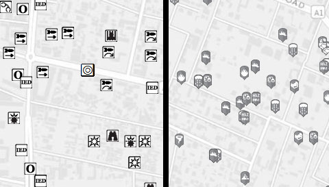

solutions-symbology-data
========================

The purpose of the solutions-symbology-data repository is to share, edit, and develop symbols for the different ArcGIS solutions. This repo does not include standard military symbology such as 2525 and APP. 

## Features

* Source Symbology for the Incident Analysis Template
* More to come

## Sections

* [Requirements](#requirements)
* [Instructions](#instructions)
* [Resources](#resources)
* [Issues](#issues)
* [Contributing](#contributing)
* [Licensing](#licensing)

## Requirements

* ArcGIS Desktop 10.0 (or later)
    * If you wish to use the styles from this repository
* If you wish to add to or otherwise modify this symbol set
    * Scalable Vector Graphic (SVG/.svg) Editor of your choice
    * Inkscape 0.48 (or later) - used to convert .svg files to .emf/.png

## Instructions

### General Help

* [New to Github? Get started here.](http://htmlpreview.github.com/?https://github.com/Esri/esri.github.com/blob/master/help/esri-getting-to-know-github.html)

### Using the Source Data

* Download the repository
* In ArcGIS Desktop,
    * Use the Style Manager to add the desired style to ArcGIS Desktop.
    * e.g. add style from solutions-symbology-data\data\incident-symbols.
* You may also wish to update/copy the .style files from each source folder into your ArcGIS Desktop Style folder installation (if you wish to install these more permanently).
 
### Modifying the Source Data
   
* Build your own icons in the graphics editor of your choice. 
* Save each symbol as a SVG file (.svg). 
* Ensure that the Inkscape SVG editor/converter is installed
* Modify as necessary the [converter .bat command file](./tools/SVGtoPNG.bat)
    * NOTE: you may need to change this .bat file to
    * Change the paths to Inkscape and the local data on your machine
    * Change the desired export image width and height
        * `--export-width=64 --export-height=64`
        * Or remove these options to use the source image size properties (currently 18X18 pixels)
* Run the .bat file in the command prompt to convert your symbols from .svg to .png.
* Import each symbol into ArcMap the desired style as a picture marker graphic.
* Save your new style file.
* (Optional) Make a Pull-Request to include your new/modified files.

## Resources

* [Incident Analysis Template](http://maritime-ops.maps.arcgis.com/home/item.html?id=fd6e2c3272c14826b9781e93580dacfe)
* [Source Data for Military Feature (2525 & APP) Symbology](https://github.com/Esri/military-features-data)
* [Inkscape](www.inkscape.org)

## Issues

Find a bug or want to request a new feature?  Please let us know by submitting an issue.

## Contributing

Esri welcomes contributions from anyone and everyone. Please see our [guidelines for contributing](https://github.com/esri/contributing).

## Licensing

Copyright 2014 Esri

Licensed under the Apache License, Version 2.0 (the "License");
you may not use this file except in compliance with the License.
You may obtain a copy of the License at

   [http://www.apache.org/licenses/LICENSE-2.0](http://www.apache.org/licenses/LICENSE-2.0)

Unless required by applicable law or agreed to in writing, software
distributed under the License is distributed on an "AS IS" BASIS,
WITHOUT WARRANTIES OR CONDITIONS OF ANY KIND, either express or implied.
See the License for the specific language governing permissions and
limitations under the License.

A copy of the license is available in the repository's
[license.txt](license.txt) file.

"Falling" icon used from the [Noun Project by Andrea Novoa](http://www.thenounproject.com/Andiinnoo/) under the
[Creative Commons Attribution 3.0](http://creativecommons.org/licenses/by/3.0/us/) license

Thanks to the other designers for Public Domain Icons used from [The Noun Project](http://thenounproject.com/).

